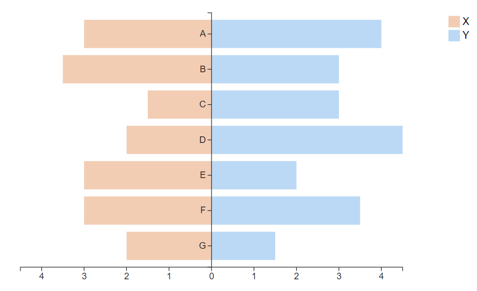
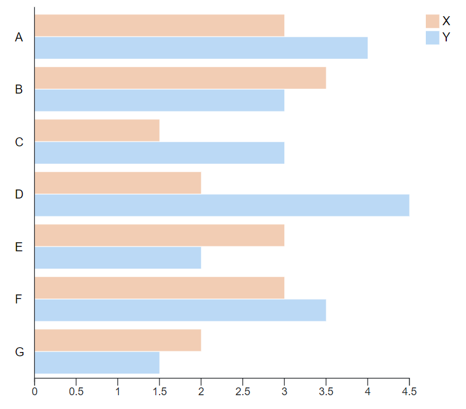
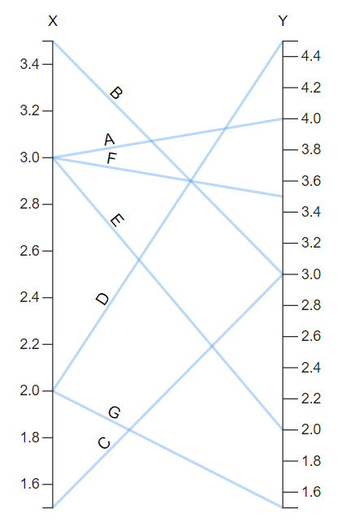
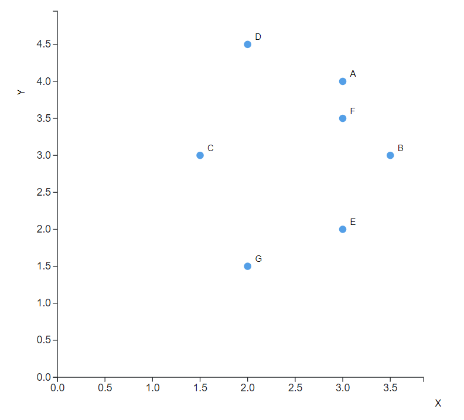

# D3 V7 React Visualizations
A set of plots developed with version 7 of D3.JS and integrated with ReactJS version 18.

## Plots included
This pack of plots includes:
* Bidirectional bar chart
* Grouped bar chart
* Parallel coordinates plot
* Scatterplot

## Functionality
Interaction allowed:
* Hovering
* Selecting

## Previews
 
 
 
 

## Run the application

```bash
git clone https://github.com/CarolinaMPereira/D3-V7-React-Visualizations.git
cd D3-V7-React-Visualizations
npm i
npm run start
```

Open http://localhost:3000/ in your web browser.

